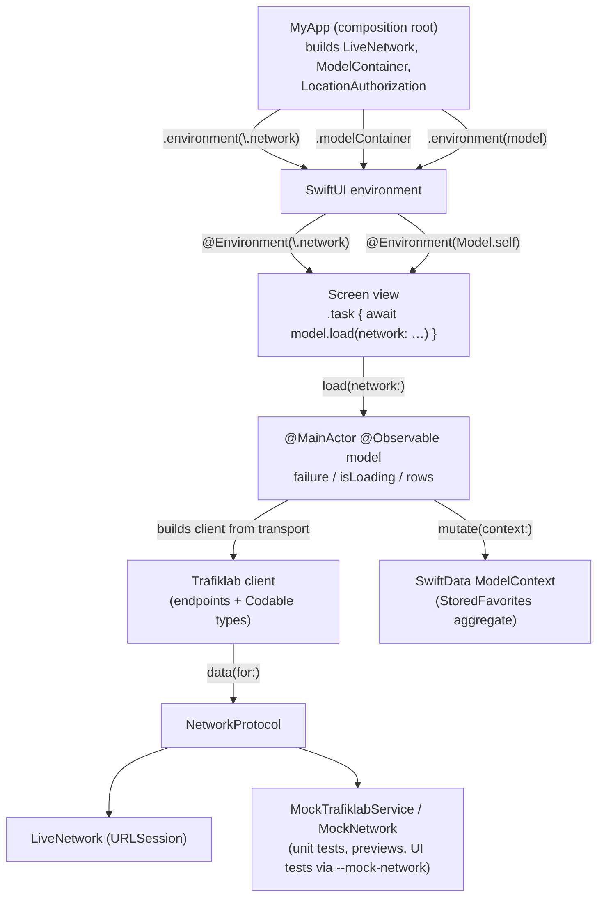

# OnBoard

A SwiftUI app for following buses and other public transport in Sweden, built on
Trafiklab's Realtime APIs and ResRobot.

OnBoard is also an **example of an iOS architecture driven by SwiftUI**: the app
uses only Apple frameworks — SwiftUI, SwiftData, Observation, CoreLocation, and
Foundation — and has **no external dependencies**. Every dependency (network,
storage, location) is a small protocol injected through the SwiftUI
environment, so the same views run in previews, unit tests, and UI tests.

## Features

- **Nearby** — finds stops around your location (ResRobot Nearby Stops) and
  shows upcoming departures for a chosen stop (Timetables).
- **Favorites** — saves stops persistently with SwiftData.
- **Search** — searches stops by name (Stop Lookup) and follows a vehicle's
  live trip between stops (Trips).

## Architecture

The app is organized into feature folders, each owning one screen:

```
OnBoard/
├── MyApp.swift            # App entry point; builds and injects dependencies
├── MainView.swift         # Tab layout; owns and publishes shared models
├── Api/                   # Trafiklab client, secrets, canned service mocks
├── Network/               # NetworkProtocol, LiveNetwork, MockNetwork
├── Location/              # Location authorization and permission UI
├── Nearby/                # NearbyModel + NearbyView
├── Favorites/             # FavoritesModel + FavoritesView
├── Search/                # SearchModel + SearchView
├── StopDetails/          # StopDetailsModel + StopDetailsView
└── RouteDetails/         # RouteDetailsModel + RouteDetailsView
```

### Design tokens

The visual language (the storyboard's Ink/Paper/Panel neutral ramp, the magenta
brand color, and the green/yellow/red status colors) lives in
`Assets.xcassets` as color sets, each with a light and dark appearance so dark
mode comes for free. The build setting
`ASSETCATALOG_COMPILER_GENERATE_SWIFT_ASSET_SYMBOL_EXTENSIONS = YES` makes
Xcode generate the `Color` accessors automatically (`.ink`, `.panel`,
`.statusGreen`, …), so **there is no hand-written `Color` extension** — adding
a color means adding a `.colorset` in the catalog and using the generated
symbol, nothing else.

The core patterns:

- **Observable models**: each screen's state lives in a `@MainActor
  @Observable final class` model that owns one load lifecycle and surfaces
  errors as a `failure: String?`. A model's `init` takes no dependencies;
  load/mutate methods receive them (`loadStops(network:latitude:longitude:)`),
  so tests inject mocks directly.
- **Environment injection**: `NetworkProtocol` is published with
  `.environment(\.network, network)` and models with `.environment(model)`;
  views read them with `@Environment(\.network)` and `@Environment(Model.self)`.
  The environment defaults to `LiveNetwork`, so views render in previews
  without wiring.
- **Protocol-oriented dependencies**: `LiveNetwork` (URLSession) is the
  production transport; `MockNetwork` and `MockTrafiklabService` provide
  handler registration, request tracking, and canned responses for tests
  and previews.
- **API client built per call — a documented trade-off**: each model constructs
  its own `Trafiklab` client inside the load method (`let api = Trafiklab(network:
  network)`). That keeps `Trafiklab` out of the model's initializer and the
  environment, so a test injects a mock by passing a `NetworkProtocol` alone.
  The cost: there is no shared place for cross-cutting concerns. If your app needs
  those, invert the injection: make the API client itself the protocol
  injected through the environment (`@Entry var api: any TrafiklabAPI`) and
  keep the transport a detail of its live implementation.
- **SwiftData persistence**: the app entry point builds the `ModelContainer`
  and injects it with `.modelContainer(container)`; views hand the
  environment's `ModelContext` to their model's load/mutate methods. Each
  feature persists one aggregate root (e.g. `StoredFavorites` with a cascading
  relationship to `[Favorite]`). A container that fails to open crashes at
  startup **by choice** — the app has no working persistence without it, and a
  loud failure beats silently dropped writes. An app that can rebuild its
  store (or migrate a stale schema) should catch and recreate the container
  there instead; that policy is a product decision, so it is written down
  rather than inherited.
- **Presentation on the domain type**: display logic (transport mode icons,
  labels, parsed dates) lives in computed properties on the value types via
  `Type+Feature.swift` extensions next to their consumers, so it is shared
  instead of duplicated per screen.

UI tests substitute mocks through launch arguments (`--mock-network`,
`--skip-location-permission`, `--mock-storage`) checked in `MyApp`, which keeps
the entry point self-contained.

## Why this architecture

The point of this layout is that **SwiftUI is the framework**: no Combine
publishers, no coordinator objects, no third-party state containers. The
constraints and what they buy:

- **No external dependencies** — the whole dependency surface is three
  protocols (`NetworkProtocol`, `LocationManager`) and SwiftData. Nothing to
  version, nothing to audit, and the same code teaches you the platform
  primitives an MVVM/TCA layer would otherwise wrap.
- **`@Observable` models over `ObservableObject`/`@Published`** — granular
  tracking means a screen re-renders only for the properties its body reads,
  and models stay plain Swift (no `@Published` wrappers, no `objectWillChange`).
- **Dependencies on methods, not `init`** — a model's `init` takes nothing, so
  constructing one in a view (`@State var model = Model()`) or a test
  (`Model()`) never needs a container or factory; the load call receives the
  transport (`loadStops(network:…)`), which is also the seam a test injects
  through.
- **The environment is the composition root's delivery mechanism** — the app
  entry point is the only place that decides *which* implementations exist;
  everything downstream reads an abstraction. Views get previews for free
  because the environment's defaults are the live implementations, and
  previews/tests override exactly the values they need.
- **Feature folders over type folders** — a screen's model, view, and
  presentation extensions live together, so adding a feature is adding a
  folder, and deleting one removes everything it owns. Only cross-cutting
  infrastructure (`Network/`, `Location/`, `Api/`) sits outside.

## Replicating this in your app

The checklist, in the order we'd apply it to a new app:

1. **Model each dependency as a small protocol** with one live implementation
   (`LiveNetwork`) and no globals. If you can't name a second implementation
   you'd want (mock, preview stub, cache-decorated), you don't need the
   protocol yet.
2. **Publish it with `@Entry` on `EnvironmentValues`, defaulting to the live
   implementation**, so views and previews render without wiring:
   `@Entry var network: NetworkProtocol = LiveNetwork()`.
3. **One `@MainActor @Observable final class` per screen**, `init()` taking
   nothing, a single load lifecycle per fetch, errors surfaced as
   `failure: String?` rather than thrown.
4. **Load in `.task`/`.task(id:)`, never in the model's `init` or a factory**,
   so SwiftUI owns the async lifetime and cancels it for you.
5. **Inject shared, cross-screen models (`FavoritesModel`) from the owning
   view with `@State` + `.environment(model)`**, read with
   `@Environment(Model.self)`.
6. **Persist through the environment's `ModelContext` passed into
   load/mutate methods**, one aggregate root per feature, created on demand.
7. **Serve tests/previews from a feature-specific mock service**
   (`MockTrafiklabService`) that round-trips real `Codable` types for the real
   endpoint paths, and keep a bare `MockNetwork` only for request-shape
   and invalid-input assertions.
8. **Drive UI tests with string launch arguments** checked in the app entry
   point's `make*()` factories (`--mock-network`), so the harness is the same
   code path production uses.

### How the pieces fit



## API keys

The app reads its Trafiklab API keys from a `Secrets.env` file bundled with the
build. The file is git-ignored, so it is not part of the repository:

1. Register at [developer.trafiklab.se](https://developer.trafiklab.se) and
   create one key per product: "Trafiklab Realtime APIs" (Stop Lookup,
   Timetables, Trips) and "ResRobot v2.1" (Nearby Stops).
2. Create `OnBoard/Secrets.env` with your keys:
   ```
   TRAFIKLAB_REALTIME_KEY=your-realtime-key
   TRAFIKLAB_RESROBOT_KEY=your-resrobot-key
   ```
3. Build and run. Xcode's file-system-synchronized target bundles the file into
   the app automatically.

Without the file every screen shows its load failure instead of silently
sending empty keys.
